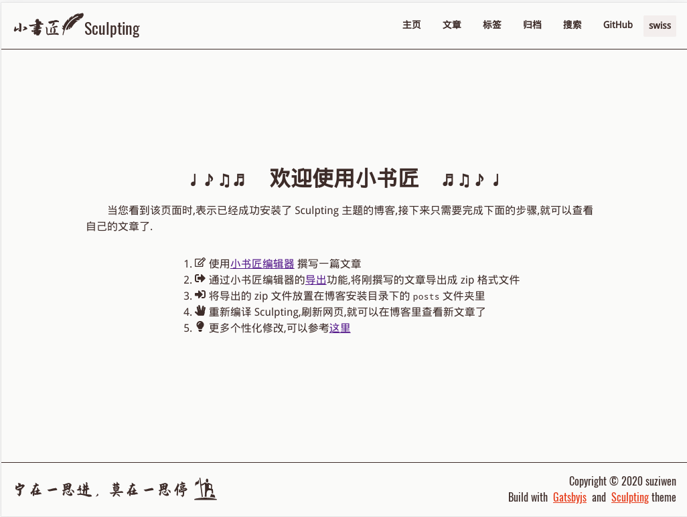

  

<h1 align="center">
  A Gatsby Theme Sculpting workspace
</h1>

> Sculpting 主题是一款基本 [Gatsby](https://www.gatsbyjs.org/) 开发并使用[小书匠](http://markdown.xiaoshujiang.com)导出的 zip 做为数据源的静态博客主题.

Github 地址: https://github.com/suziwen/gatsby-theme-sculpting
Gitee  地址: https://gitee.com/booksmith/gatsby-theme-sculpting

# 示例

[Scrat's Acorn](https://suziwen.github.io/acorns/)

# 主要特性

 - 基于 [Gatsby](https://www.gatsbyjs.org/)
 - 基于 [React](https://reactjs.org/)
 - 使用 Theme UI 主题配置,默认提供 `light`, `dark`, `deep`, `swiss` 四种主题配色
 - 与 [Github Action](https://github.com/features/actions) 无缝集成,快速发布
 - 响应式设计
 - 纯静态
 - 优雅,简洁
 - 标签
 - 归档
 - 评论
 - 全文搜索
 - rss
 - 图片预加载
 - 网页访问统计

# 详细使用说明

[详细说明](theme/README.md)

[详细说明](https://suziwen.github.io/acorns/sculpting/sculpting_theme_introduce)

# Gihthub Action 集成

https://github.com/suziwen/gatsby-action-sculpting

# 谁在使用

[Scrat's Acorn](https://suziwen.github.io/acorns/)

# License

MIT
